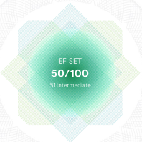

# Mariya Ivonina


## Contacts
- Phone: +7-930-80-66-777
- Telegram: @Deniza235
- GitHub: Deniza235
- Email: lobashova.mariya@mail.ru

***

## About me
_I'm a beginner Front-end developer. One of my strong skills is perseverance towards understanding this area of IT. I like that I can see the result of my work immediately. It's nice to work with the visual part of the browser. I continue to study, learn new things and apply this in my educational projects._

***
## Skills
* HTML , CSS , Basic JS
* GIT, GitHub , GitLab
* VS Code
* Figma , Photoshop

***
## Code example
Favorite movies rating :
```
let rating = ['The Green Mile', 'The Shawshank Redemption', 'Schindler`s List', 'Forrest Gump', 'Harry Potter','The Lord of the Rings'];

console.log('Favorite movies rating:');
for (let i in rating) {
    console.log(`#${parseInt(i) + 1} movie: ${rating[i]}`);
}
```
***
## Experience
My training project :
> The Lagoona is a site of a hotel that offers a full range of leisure facilities.
[GitHub Pages](https://deniza235.github.io/Lagoona/)

***
## Education
**Lobachevsky State University of Nizhny Novgorod**

Specialist's degree
- Financial management

**Online Courses:**
* Skillbox - _Front-end developer profession_
* Code Basics: HTML, CSS, JS
* Orion Innovation

***
## English level

B1 , Intermediate




